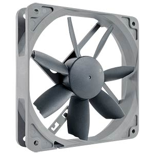
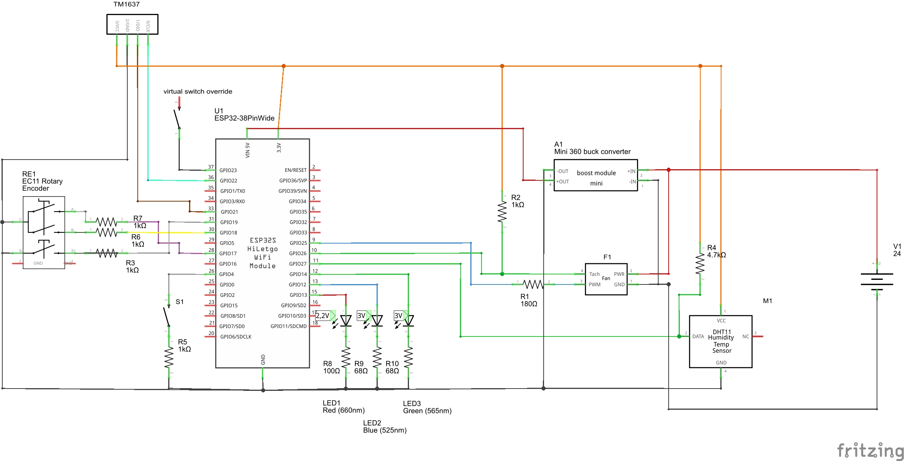

# Fan at workbench
This ESP32 controls the fan of the work bench during welding via the rotary push button at the ESP box. When in local mode the fan of the workbench can be controlled via the rotary push button and when in remote operation the logic in NodeRed is used to reduce the humidity in the shed by operating the fan.

## Description and operation instructions
To operate the fan, the control must be in local mode. This is indicated by a blue led on the ESP. When in remote mode, a green led is lith. When the controls are overridden by the Override button in Home Assistant, then the only way to operate the fan is via the buttons in Home Assistant. Switching between local and remote mode is done by pushing the push button. The blue and green leds will light up to indicate the mode. The override button can only be changed via Home Assistant.
In local mode the fan operation is controlled by rotating the rotary push button clockwise to start the fan. The RPM of the fan is indicated from 0 to 100%. Turning counter clockwise will reduce speed. Pushing the rotary push button will turn off the fan immediately.
The fan and the LED display indicates the RPM in %.
In remote mode the fan is turned on when a certain humidity is detected and turned off when it is below another humidity value. Opening or closing the shed door has impact as with an open door it is not logical to run the fan. Hence opening the sheddoor will immediately shut down the fan. The fan is controlled via different levels where at lower humidity levels the fan runs at a lower RPM and when the hunidity level is high the fan runs at a higher RPM. The fan is also turned on when the temperature is very high. The humidity logic is running in NodeRed.

 ## Technical description
A 24V IP65 fan is used as this has a high air volume movement. The 24 voltage is reduced by a mini 360 DC-DC converter to fit a decent voltage of about 7V for the ESP. The DC-DC converter is specified for max 23,5V, but I wonder how tollerant this converter will be. A heatsink is used to reduce the heat of the converter. An DHT11 sensor is used for the temperature and humidity. A 4,7kOhm resistor is used as pull up of the DHT11 data signal.
A NO momentary push button is connected via a 1kOhm resistor to GND. The GPIO is configured as a pull up pin to ensure no false signals.
The EC12 rotary push button is split into 3 connections to the ESP. All 3 have a 1kOhm resistor where the GPIO pins all are configured with an internal pull up. The push action is separated from the rotary and can be treathed as a momentary push button. The rotary function uses pulses and depending on clockwise or counter clockwise it has phase shifted pulses. 
A TM1637 indicates the RPM of the fan in %.
The PWM fan is controlled via the PWM signal coming from the ESP32. A 180Ohm resistor is placed between the GPIO and the PWM connection of the fan. The tacho signal needs a pull up to 3.3V. This could be higher, but the ESP will not accept higher voltages. In practice the 3,3V seems sufficient.
The ESP32 is running ESPHOME and connected to Home Assistant. 
The green and blue LEDs are each connected via a 330Ohm resistor to reduce the max current to 10mA. The red LED is connected via a 220Ohm resistor. All LEDs are configured via a PWM signal. Simply because the ESP has sufficient PWM outputs and this way the light intensity can be controlled.

### Parts All below this line NEEDS updating vvvvvvvvvvvvvvvvvvvvvvvvvvvvvvvvvvvvvvvvv
1 x ESP32

1 x DHT22 or AM2302 vs DHT11

1 x Fan NO NF-S12B 1200P Noctua NF-S12B redux-1200 PWM, 120mm

Fan pinout pinout

1 x Mini360 DC- DC buck converter

Resistors
1 x 180
3 x 1k
1 x 4k7

1 x 24V DC adapter

### Schematic overview

 
Connector connections overview

•	Power the circuit only via 24V and run code updates via OTA and ESPHOME.

### ESPHOME Configuration
### ESPHome Configuration in Home Assistant
Create a new ESPHOME device with this code:
### Code
[Code in ESPHOME](code.vbs)